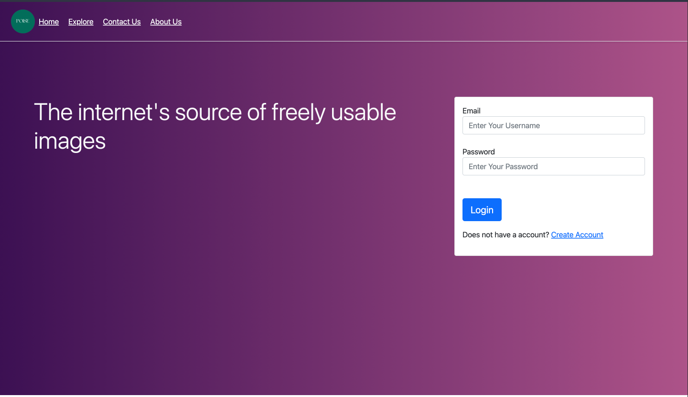

# pexels-replica

# Installation

Clone the repository and install the dependencies.

`pip install -r requirements.txt`

Make a keys.py file and add your API key in `pexels/home` as follows :

`unsplash_key = 'Values'`

Get your API key from [Unsplash](https://unsplash.com/developers)

# Usage

Use the following command to run the application. Run migrations before running the application once only.

```cd pexels```

To make migrations & migrate

```
python manage.py makemigrations
python manage.py migrate
```

To run the server

```python manage.py runserver``` 

# Screenshots




